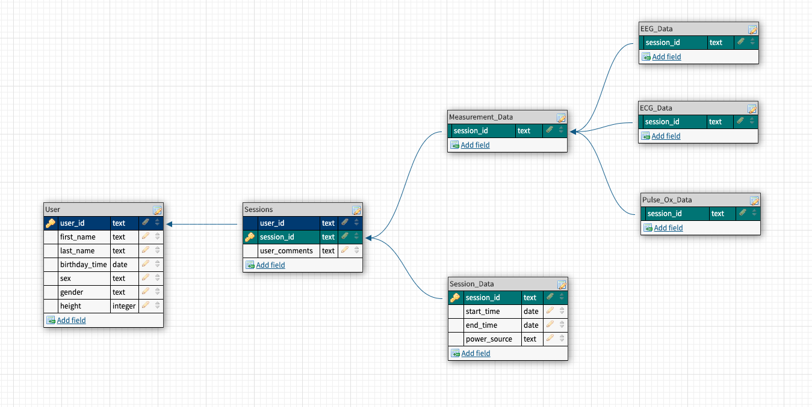

# Personal Biometrics Monitoring (PBMon)

## Goal:
* Create a browser based dashboard for displaying biometric data
* Biometrics comes from sensor hardware, via microcontroller.
* User can record timed data collection "sessions" (3-5min).
  * Measurements (metrics)
    1. Electrocardiogram
    2. Electroencephalogram
    3. Pulse Oximetry
    4. Body Temperature (stretch goal)
  > Each metric should probably have its own clock
  * Session data will stored in structured database
* Users will be able to see comparative data & visualizations about prior sessions.

### Simple Database Design:

## To Do:
* [ ] Set up PostgreSQL DB (via axios for now)
  * [ ] Create example schema
  * [ ] Send entry from client to DB
  * [ ] Query for entries by user_id :
    * [ ] All
    * [ ] Single
    * [ ] By parameter (basic search?)
* [ ] UI Improvements
  * [ ] Provide queried data to UI
    * [ ] Animation?
  * [ ] Material UI
  * [ ] StoryBook